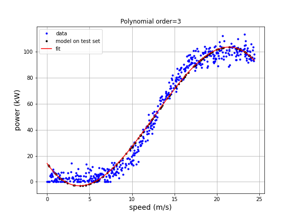
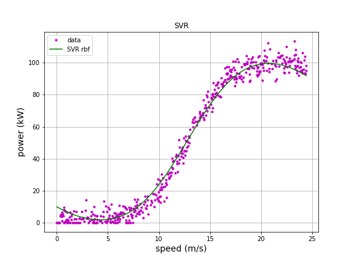
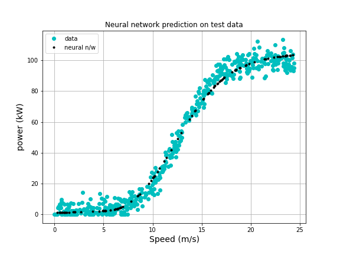
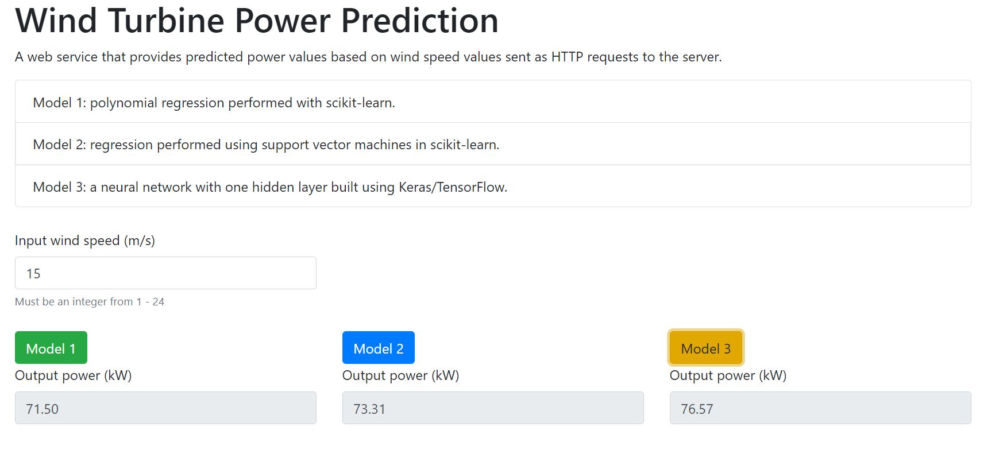

# project-machine-learning
HDip Data Analytics 2020 Machine Learning &amp; Statistics Project

<p align="middle">
  
</p>

## Description

This README describes work done for the Machine Learning and Statistics module project, due 8 January 2021. We have been asked to create a web service that uses machine learning to make predictions based on the data set provided. We should train a model (or more than one) that accurately predicts wind turbine power output from wind speed values. The web service responds with a predicted power value when a wind speed value is sent as a HTTP request. I have trained three models for the project:
- Model 1: polynomial regression performed with scikit-learn.
- Model 2: regression performed using support vector machines in scikit-learn.
- Model 3: a neural network with one hidden layer built using Keras/TensorFlow.

From the figures below, it's clear that Model 3, the neural network, does the best job over the full range of wind speed values. Models 1 and 2 do an ok job provided wind speed is in the range 5 - 20 m/s. I would use Model 3 as my final model.  

<p >
  
  <figcaption>Model 1. Third order polynomial regression.</figcaption>
</p>

<p>
   
  <figcaption>Model 2. Support vector machine regression.</figcaption>
</p>

<p>
  
  <figcaption>Model 3. Sequential neural network.</figcaption>
</p>

<!--


-->

## Getting started

These instructions will get you a copy of the project up and running on your local machine for development and testing purposes. The web server looks like this:

<p>
  
</p>

There are some basic JavaScript checks in the index.html file to test if the input is a number and if it lies within the allowed range of values.  

## Project repository
This project is hosted on [GitHub](https://github.com/) at 
https://github.com/elizabethdaly/project-machine-learning

### Instructions for cloning the repository
A repository on GitHub exists as a remote repository. You can clone this repository to create a local copy on your computer by following these instructions:
1. On GitHub, navigate to the main page of the repository https://github.com/elizabethdaly/project-machine-learning
2. Under the repository name, click Clone or download.
3. Choose "Clone with HTTPS" to copy the address.
4. Open a terminal on your machine. Change the current working directory to the location where you want the cloned directory to be made.
5. Type git clone, and then paste the URL you copied above:

```git clone https://github.com/elizabethdaly/project-machine-learning```

6. Press enter to clone the repository to your machine.

### Static version of the notebook
One can view a static version of the notebook using [Jupyter Nbviewer](https://nbviewer.jupyter.org/). Enter the GitHub url below to view the file.

```https://github.com/elizabethdaly/tasks-machine-learning/blob/master/project-machine-learning.ipynb```

## Prerequisites
- [Anaconda distribution of Python](https://www.anaconda.com/distribution/)
- [Python Software Foundation](https://www.python.org/)
- [Project Jupyter](https://jupyter.org/)
- [matplotlib: Python plotting library](https://matplotlib.org/)
- [NumPy](https://numpy.org/)
- [SciPy](https://www.scipy.org/)
- [Pandas](https://pandas.pydata.org/)
- [Scikit-learn](https://scikit-learn.org/stable/)
- [PIP](https://pip.pypa.io/en/stable/)
- [TensorFlow](https://www.tensorflow.org/)
- [Docker](https://www.docker.com/resources/what-container)
- [Flask](https://flask.palletsprojects.com/en/1.1.x/)

## Files
- Data analysis and model training/evaluation in a single Jupyter notebook **project-machine-learning.ipynb**
- Data set **data/powerproduction.csv**
- **static/index.html** file for the web server front end.
- **MLserver.py** file for flask server at repository top level.
- Model files in **models** subdirectory.
    - **poly-reg.pkl** (polynomial regression)
	- **svm-reg.pkl** (support vector machine regression)
	- **scalerX.pkl** (scaler pre-processing for SVM regression above)
	- **neural-nw.h5** (sequential neural network)
- **requirements.txt** requirements to run flask app in a virtual environment.
- **deploy/app.py** edited flask app for hosting on PythonAnywhere
- Some references in **references** subdirectory.
- All images in **img** subdirectory.
- Rough work/old files in **rough** subdirectory.

(Please note that the commands to save the model files have been commented out in the Jupyter notebook so that my final models are not overwritten. If you wish to resave them, just remove the comments.)

## Installing packages and running the server on your localhost
Download and install the Anaconda distribution of Python from the link above. Most packages (Jupyter notebook, Pandas, matplotlib, NumPy, and Scikit-learn) come as part of that distribution. I used the Python package management system (PIP) to install any additional packages, such as TensorFlow and Flask, as follows:
1. First make sure you are using an up-to-date version of pip
```python -m pip install --upgrade pip```
2. Install TensorFlow 
```pip install tensorflow```
3. Install Flask
```pip install flask```
4. Tell flask which server to use and run it
```set FLASK_APP==MLserver.py```
and 
```python -m run flask```

## To run the flask app from inside a virtual environment
1. Set up a Python virtual environment (VE) ```python -m venv venv``` The second venv is the name of the directory which is created to hold the VE configuration.

2. Activate that VE ```.\venv\Scripts\activate.bat```.
Check to see if any packages are installed in the VE with ```pip freeze``` (there should be nothing at this stage) .

3. Run ```jupyter notebook``` if you wish to re-train models and save them again. Note that I did not need to install Jupyter notebook in this VE as it seems to know what kernel to use. Apparently, the set of kernels available is independent of what your VE is when you start Jupyter notebook. You can check what kernels are available with ```jupyter kernelspec list```. I have one python3 kernel so I decided to just stick with it for my VE.

4. Tell flask which server to use 
```set FLASK_APP==MLserver.py``` and run it 
```python -m run flask```

5. You will get a series of error messages if any packages required by MLserver.py are not installed in the VE. Install them one by one.
- ```pip install numpy==1.19.3``` (Got errors with newer version 1.19.4)
- ```pip install joblib``` (For importing scikit-learn learning models)
- ```pip install sklearn``` (To make predictions from a scikit-learn model)
- ```pip install tensorflow``` (To import tensorflow models - this step took about 10 minutes and I had make a few attempts.)

6. Repeat step 4. to run the server and interact with the front end at http://127.0.0.1:5000/

7. Save a list of required packages to a file **requirements.txt**
```pip freeze > requirements.txt```

8. When finished, deactivate the VE ```.\venv\Scripts\deactivate.bat```

9. Note that if you want to set up a copy of this VE, you can install all packages with

```pip install -r requirements.txt```

10. Don't forget to add ```venv/``` to your .gitignore file! 

## To containerize the app with Docker

Docker allows one to gather everything required for an  application in images & containers. The first step is to build a Docker image - a read-only template that contains a set of instructions for creating a container that can run on the Docker platform. A container is a standard unit of software that packages up code and all its dependencies so the application runs quickly and reliably from one computing environment to another. Containers are dependent on images, and use them to construct a run-time environment and run an application. The commands required to build a Docker image are listed in the file **Dockerfile** in this repository. I edited this file to tell Docker my exact version of Python (3.8.5) and the name of my flask app **MLserver.py**

I installed Docker Desktop for Windows (Home 64 bit) from [here](https://hub.docker.com/editions/community/docker-ce-desktop-windows/). I then had to install the Linux Containers WSL 2 backend from [here](https://docs.docker.com/docker-for-windows/wsl/). Check docker version with ```docker --version``` Mine is: Docker version 20.10.0, build 7287ab3

To run the application via Docker from the command line:

1. ```docker build -t model-server .``` to build a docker image called model-server.
2. ```docker image ls``` to list images.
3. ```docker run -d -p 5000:5000 model-server``` to create an instance of the image in a container.
4. Once the container is running, access the web service on your localhost at http://127.0.0.1:5000/ to get predictions of power output for input wind speeds.
5. ```docker container ls``` to list containers by ID.
6. ```docker kill ID``` to stop a container with given ID
7. ```docker container ls -a``` to check that the container is really gone. If not do
8. ```docker kill ID```

Note: My docker image model-server took over 20 minutes to build, most of that time seemed to be spent installing TensorFlow. The file is big.

```docker image ls```
REPOSITORY | TAG | IMAGE ID | CREATED | SIZE
--- | --- | --- | --- | --- 
model-server | latest | 84d96ad68fdc | 6 hours ago | 3.45GB

```docker container ls```
CONTAINER ID | IMAGE | COMMAND | CREATED | STATUS | PORTS | NAMES
--- | --- | --- | --- | --- | --- | ---
503ffc3ecb9e | model-server | "/bin/sh -c 'flask r…" | 10 seconds ago | Up 8 seconds | 0.0.0.0:5000->5000/tcp | fervent_lederberg

[1] stackify, [Docker Image vs Container: Everything You Need to Know](https://stackify.com/docker-image-vs-container-everything-you-need-to-know/)

## To host the Flask app on eu.pythonanywhere.com
This Flask app is hosted remotely at: http://elizabethdaly.eu.pythonanywhere.com/

It was a long and torturous process to get this working. Even now, the model which is based on TensorFlow (Model 3) is not working on the hosted web page although no errors are flagged. Models 1 & 2, based on scikit-learn, are working fine. I'll summarize what I did briefly.

1. As I am using Python 3.8.5, I first created a new Web App on pythonanywhere (PA) based on Flask and Python 3.8. I uploaded all my files to the site and edited the wsgi config file to point to my flask app (**app.py**). This file is just a slightly edited version of MLserver.py with some changes specific to PA. I created a Python 3.8 virtual environment on PA and, one by one, pip installed the modules I needed - the error log on PA tells you what's missing when you try to load the app. All was going well until I attempted to install tensorflow. It turns out that it is too big to install on a free PA account, and I got error messages about my disk quota being exceeded.

2. PA does have some pre-installed packages (called Batteries Included), that are possible to use without the need to create a virtual environment. I saw that tensorflow comes installed for Python 3.7, so I created a new Web App based on Python 3.7 and attempted to run the app again without a virtual environment. This time I got error messages referring to *sklearn.linear_model._base*, which I tracked down to a discrepancy between the PA version of scikit=learm==0.21.3 and my own version used to create the models, scikit-learn==0.23.2

3. I created a new Python 3.7 virtual environment with a flag which allows access to the system site packages from within it. 
```mkvirtualenv venv37 --python=python3.7 --system-site-packages``` 
I then upgraded the version of scikit-learn to match my own and the sklearn error disappeared.
```pip install --user --upgrade scikit-learn==0.23.3 ```

4. I still had "file not found" errors relating to my models although I placed all model files in the same location as the app itself on PA. These errors were resolved by providing the full path to the model files when loading them, not just a relative path.

5. The last error I had to resolve with the PA Web App was related to TensorFlow. The error log showed 
	- *KeyError: 'sample_weight_mode'* at the point when the tensorflow model is being loaded.
	- *model = load_model("/home/elizabethdaly/mysite/neural-nw.h5")*
	- I was able to get rid of the error (although I'm not sure how it affects the loaded model and its ability to make predictions) by adding a flag to load_model:
	- *model = load_model("/home/elizabethdaly/mysite/neural-nw.h5", compile = False)*

6. There are no errors when I load my flask app on PA, but the **Model 3** button on the web page does nothing as I have commented out this part of **app.py**. If I don't comment out that app.route the web page hangs although I can see no errors in Chrome. I think the problem is caused by TensorFlow versions. I created the model on my own machine using tensorflow==2.4.0, and PA has tensorflow==2.0.0. I suspect that if I could install the newer version of tensorflow onto my PA virtual environment that the error might be resolved. I can't do that on my free PA account. 

7. I found some discussion of the *KeyError* in [3] below, but not related to hosting, just saving and loading in different sessions. I'll continue to look into the issue in a second flask app file **app_tf.py** that I have uploaded to PA. There are no errors generated on PA when I load the Web App, but the server log has some suspicious messages about tensorflow compilers. In the PA access log I can see the HTTP requests like 
	- "GET /api/model1/1 HTTP/1.1" 200
  	- "GET /api/model2/2 HTTP/1.1" 200
  	- "GET /api/model3/12 HTTP/1.1" 499 so, something is up here.

	- When I searched for 499 error code I find posts about client closing connection before server responded. Actually, if I wait long enough after clicking the Model 3 button I do get a 504 Gateway Timeout error in Chrome. For now, the Model 3 button does nothing on my hosted web page.

[2] Python Anywhere, [Batteries Included](https://www.pythonanywhere.com/batteries_included/)

[3] github.com/keras-team/keras, [KeyError: 'sample_weight_mode' #14040](https://github.com/keras-team/keras/issues/14040)

## Author
Elizabeth Daly for HDip in Data Analytics 2019/2020.

## Licence

This project is licensed under the GNU General Public License v3.0 - see the LICENSE.md file for details.